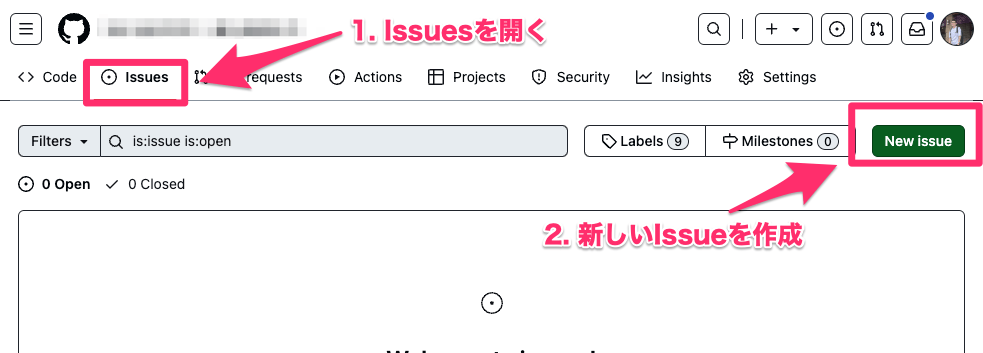
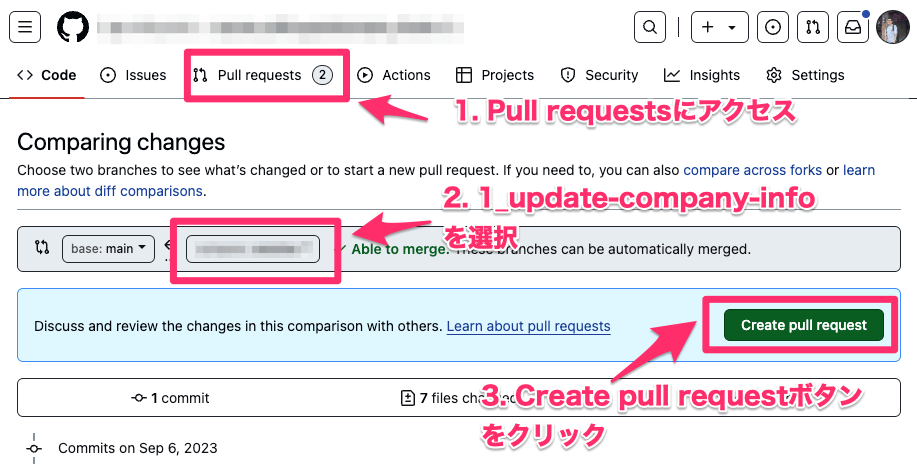
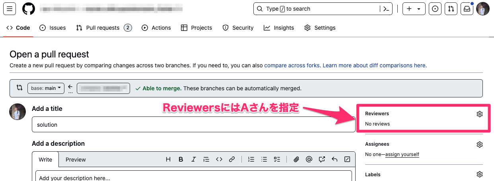
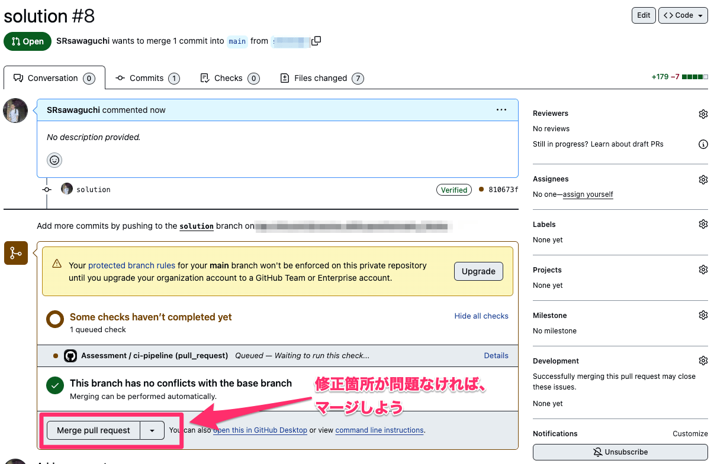
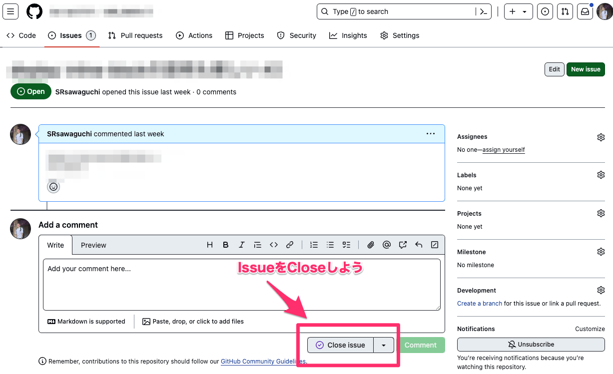

# GitとGitHubを使った開発のロールプレイ

Gitはソースコードを管理するソフトウェアです。複数人で開発しするときに便利です。GitHubはソフトウェアを開発するのに便利な機能を提供するWebサービスです。  

ここではみんなで小さいWebページの開発をしながらGitの使い方を通じて学ぼう。  
今回はGitとGitHubを使って以下の仕組みを学習します。
- clone
- pull
- commit
- push
- branch
- merge
- collision(衝突)

また、GitHubの次の機能を使います。
- issues
- pull requests

Gitを使った開発では、プロジェクトごとに運用ルールがあります。  
今回は、一般的なissuesとpull requestsを使ったシンプルなルールでロールプレイングをしてみよう。

※ここでは、CLI（コマンドプロンプト、ターミナル）からGitを使います。必要に応じてvscodeの昨日等、GUI経由でGitの機能を利用しても構いません。  

## 用語
- repository: リポジトリ。ソースコードやファイル一式。

## 準備
うまくいかなかったらメンターに聞いてください。


### Live Server(Five Server)のインストール
今回の演習では、あなたはとあるWebサイトの開発チームの一員になります。  
そこで、Webページを起動するためのソフトウェアであるLive Server(Five Server)をインストールしよう。  
Live Serverはvscodeの拡張機能です。以下のURLをクリックし、Installボタンよりインストールしてください。（途中でvscodeで開くかどうか確認されますので、承認し、vscodeよりインストールを行ってください。）  

**Live Server(Five Server)**  
https://marketplace.visualstudio.com/items?itemName=yandeu.five-server

### clone
このリポジトリを`clone`しよう。ここでは、cloneするとGitHub上のリポジトリがローカルに複製されます。  
```
git clone <リポジトリのURL>
```

cloneが終わったら、cloneして作成されたフォルダをvscodeで開きましょう。  

### Webサイトの起動
vscodeでこのリポジトリを開いたら`www`フォルダにある`index.html`をクリックして開きましょう。  
そして、vscodeの右下にある`Go Live`をクリックします。すると、自動的にブラウザが起動し`index.html`の内容が表示されます。  

会社情報のWebページが表示されれば成功です。このページをみんなで開発していきます。

## ロールプレイ
### Gitの基本
まずはGitの基本の使い方を学習しよう。  
ここでは、
1. GitHubからpullする。
1. ソースコードを修正する。
1. 修正の内容をローカルのリポジトリにcommitする。
1. ローカルでの修正内容をリモート（GitHub）にpushする。
という3つの流れを実践してみよう。

#### GitHubからpullする
pullとはリモート（GitHub）の修正内容をローカルに反映させること。言い換えれば、リモートのリポジトリ(※)の状態とローカルの状態を同期させるということ。  

※実際に同期するのは「リポジトリ」ではなく、「ブランチ」です。ここではわかりやすさのため、「リポジトリ」といいます。  

```
git pull origin main
```

### ソースコードを修正する
では早速ソースコードを修正してみよう。  
現在のページは、企業の情報と背景色が同じで見にくい。そこで、背景色を`#ebebeb`に変更しよう。  

※style.cssの`body`タグの`background-color`を変更しよう。

修正が終わったら、Webページをリロードして背景色が変わることを確認しよう。

### 修正の内容をローカルのリポジトリにcommitする
修正の内容に不具合が無かったら、続いてこの変更をcommitしよう。  
Gitはソースコードの変更履歴を保存します。そして、いつでも変更前の状態に(commitした時点での状態)戻す事ができます。  

commitするためには、変更したファイルをstageします。  
今回は`style.css`を修正したので、以下のコマンドで変更内容をstageする。

```
git add www/style.css
```

コマンドを実行すると、`style.css`がステージされる。実際に`git status`というコマンドを実行してみよう。

```
On branch master
Your branch is up to date with 'origin/main'.

Changes to be committed:
  (use "git restore --staged <file>..." to unstage)
        modified:   www/style.css
```
※若干異なる可能性がありますが、stageされていることを確認しよう。

では、stageした修正をcommitしよう。ここで、commitされるのはstageしたファイルだけです。他に変更したファイルがあったとしても、stageしなければcommitされません。  
逆に、このcommitに含めたくない場合はstageしなければ大丈夫です。

では、commitしよう。

```
git commit -m "improve style"
```

ここで、 `-m "improve style"`はcommitのコメントといいます。commitにはコメントを残して、「どのような修正だったのか」を分かるようにしておきましょう。  

#### ローカルでの修正内容をリモート（GitHub）にpushする
では、ローカルの修正をリモートにpushしよう。リモートにpushすることで、他の開発者がpullできるようになる。

```
git push origin main
```

GitHubのページからstyle.cssをみてみよう。変更内容が問題無く反映されているはず。　

#### pullしてみよう
このロールプレイに参加している他のエンジニアは、 `git pull`してみよう。その後、Webページを再読み込みすると、背景色が変わるはず。

そして、`git log`を実行して変更履歴を確認してみよう。

### GitHubを使った開発
Gitの基本が確認できたところで、今度はGitHubを使った開発を実践してみよう。GitHubを使った開発の進め方はチームごと、プロジェクトごとに違うのが当たりまえ。基本的にはチームのルールに合わせることになります。  

今回はシンプルに、次のように進めてみましょう。AさんとBさんに分かれます。
1. 【Aさん】GitHub上で修正依頼の`issue`を作成する。
1. 【Bさん】pullしてブランチを作成。修正を行い、commitしてpushする。
1. 【Bさん】GitHub上でmasterブランチに作成したブランチをマージするpull requestを作成する。
1. 【Aさん】pull requestをみて、コードレビュー。問題がなければmergeする。
1. 【Aさん】当該issueをcloseする。

ポイントは、issueを作成してから、そのissueに対応する修正を行うということです。  
では、今回は「従業員数を150人に修正する」という修正をしてみよう。  

#### 【Aさん】GitHub上で修正依頼の`issue`を作成する。
GitHubにアクセスし、`issues`リンクより新しいIssueを作成しましょう。  



#### 【Bさん】pullしてブランチを作成。修正を行い、commitしてpushする。
手順
1. pullする。
1. ブランチを作成する。
1. 修正
1. commit & push

ブランチを作成するには次のようなコマンドを実行します。

```
git switch -c 1_update-company-info
```

:bulb: `1_update-company-info`はブランチの名前です。


このコマンドを実行すると、新しいブランチが作成されます。また、新しく作成したブランチに切り替わります。  

修正するファイルはindex.htmlです。修正したら、commitしてpushしましょう。

#### 【Bさん】GitHub上でmainブランチに作成したブランチをマージするpull requestを作成する。
GitHubにアクセスして、pull requestを作成しよう。  



その際、ReviewersにはAさんを設定しよう。



#### 【Aさん】pull requestをみて、コードレビュー。問題がなければmergeする。
mergeを行うと、先ほどのBさんの修正内容がmasterブランチに反映されます。



#### 【Aさん】当該issueをcloseする。
ここまで完了すると、issueの対応が終了と言えます。  
先ほど作成したGitHub上のIssueを開き、Closeしましょう。  



## (BONUSタスク)conflictの対応
Gitといえど、みんなの修正を「いい感じ」にマージしてくれる訳ではありません。  
あくまでGitは機械的にマージするだけです。  
変更内容によっては機械的にマージできずconflict(衝突)が発生します。衝突が発生した場合は、人間同士で競合を解決していくことになります。

まずは、Conflictに関する動画をみておきましょう。  

- [Git - コンフリクト](https://info.techplay.jp/training_prep_git#prep-git-conflict)  

動画閲覧用パスワード  
```
1a!8web5Y^m67r*d
```

ここでは、同じファイルを2人で同時に編集した場合を想定して、衝突を発生させてみよう。

※衝突はプログラムのエラーなどではなく、日常的に発生するものです。対処できるのでそれほど悪い事でもありません。

では、今回は2つのissueを作成しましょう。
- 資本金を`1,800`万円に修正
- 資本金を`2020年4月1日現在`に修正
異なる開発者がそれぞれブランチを作成して作業することになります。

まずは次の手順で進めていきましょう。BさんとCさんはそれぞれブランチを作って進めていくことになります。
1. 【Aさん】issueをそれぞれ2つ作成する。BさんとCさんを各issueにassignする。
1. 【BさんとCさん】それぞれindex.htmlを修正してcommit & pushする。pull requestを作成する。
1. 【Aさん】まずはBさんのpull requestをマージする。
1. 【Aさん】つぎにCさんのpull requestをマージしようとすると、conflictが発生する。

さて、ここでCさんはconflictを解消していく必要があります。  

次の手順で解消して行きましょう。
1. いったんmasterブランチに戻って、pullする。すると、先ほどマージされたBさんの修正内容がローカルに動機される。
1. 新しく作ったブランチ（自分のブランチ）をチェックアウトしよう。
1. masterブランチをローカルのブランチにマージしよう。（衝突発生）
1. index.htmlを開いて、手動でマージを行う。その後commitしてpushする。

ここまで来ると、conflictが解消され、Aさんはpull requestをマージできるようになります。


以上でGitのロールプレイングは終了です。
今回紹介した基本的なつか使い方をベースにGitを使っていきます。
